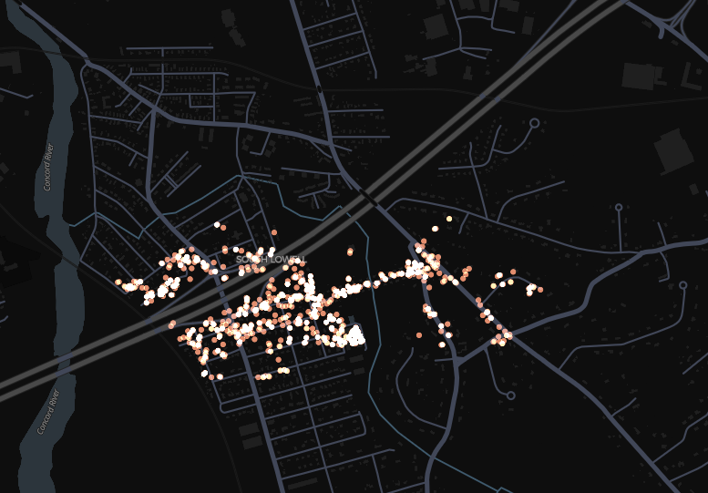
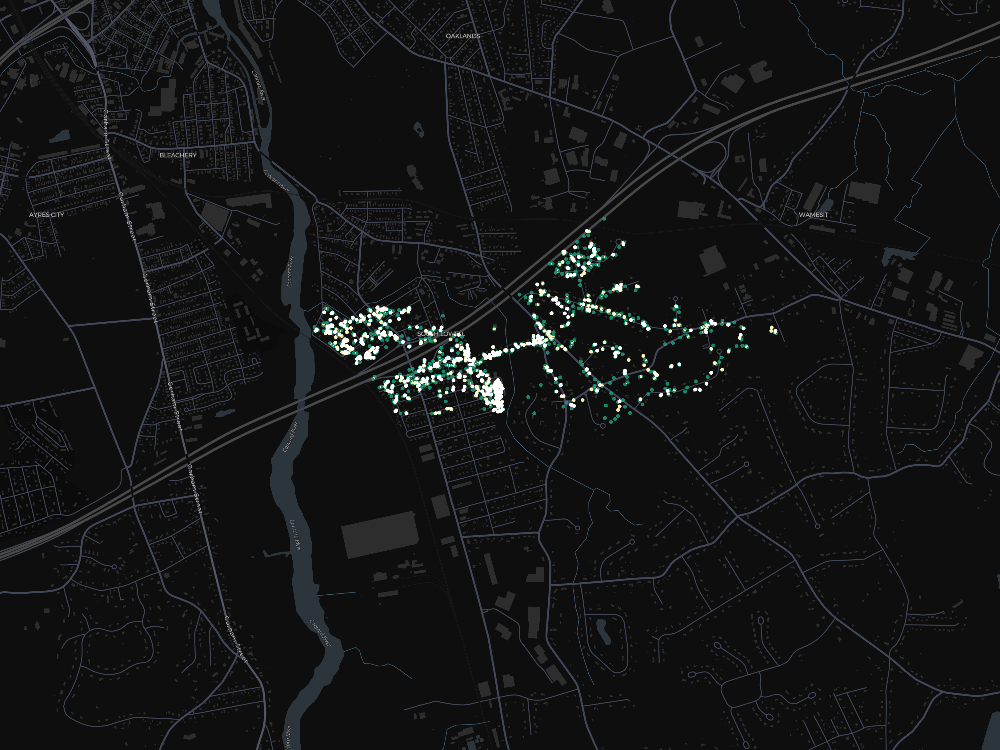
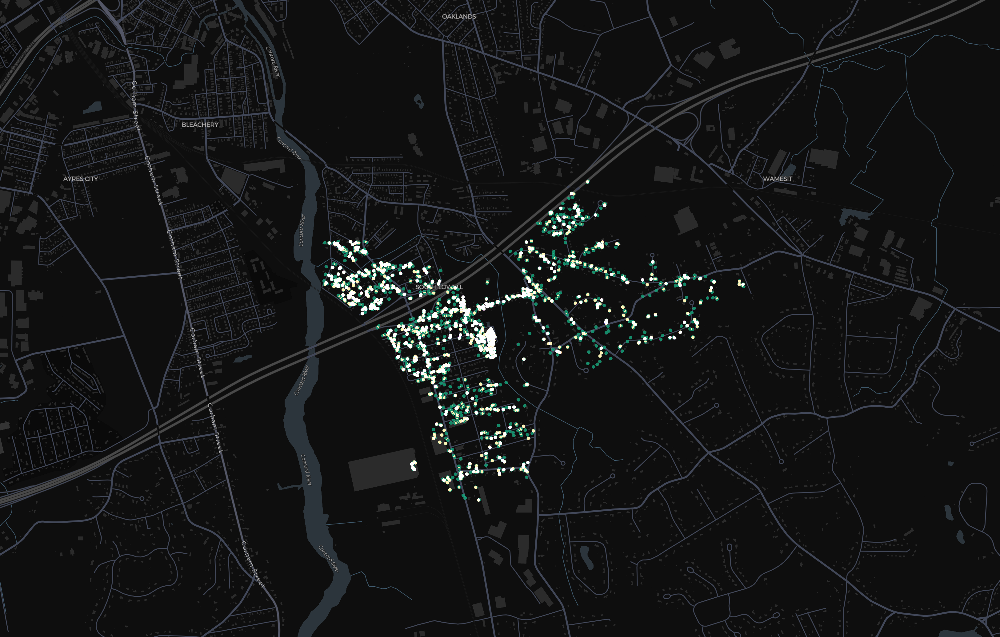
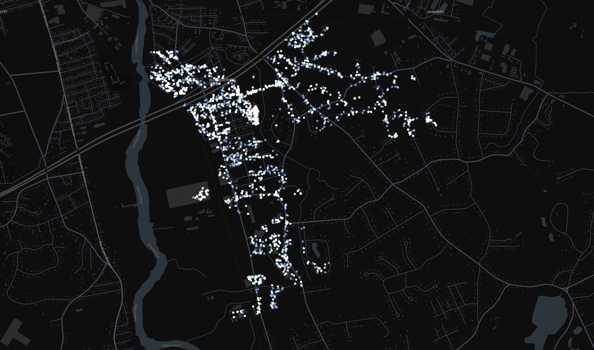

# bssid_mapping
---

## Navigation

| **Images**            | **BSSID Images**                                                  |
|------------------------|------------------------------------------------------------------|
| 200 BSSID Image      | [#200-bssid-visual](#200-bssid-visual)                             |
| 2000 BSSID Image     | [#2000-bssid-visual](#2000-bssid-visual)                           |
| 3000 BSSID Image     | [#3000-bssid-visual](#3000-bssid-visual)                           |
| 3850 BSSID Image     | [#3850-bssid-visual](#3850-bssid-visual)                           |

---

## Goals
---
1. **Collect & Map the physical locations** of Wi-Fi BSSIDs based on publicly available query APIs.
2. **Reverse-engineer BSSID structure** to infer manufacturer, region (Longitude/Latitude), and possible hardware type -> How does each # and or char relate or what does it relate to? 
3. **Optimize geospatial coverage** using adaptive strategies like perimeter walking and directional expansion.
4. **Predict unseen BSSIDs** based on clustering and Information gather from `2.` can I accurately estimate/guess others BSSID's.
5. Keep this updated as possible, including images included in `images` folder to help show with visuals.

## Overview
---
| Stage                       | Description                                                          | Status |
| --------------------------- | -------------------------------------------------------------------- | --- |
|  **Scan & Query to CSV**  | Recursive queries on selected BSSID seeds using API -> saved as .csv   | ✅  |
|  **Data Cleaning**        | Extract timestamped coordinate + BSSID pairs, drop duplicates/errors   | ✅  |
|  **Delta Analysis**       | Calculate Min/Max Lat/Lon delta to find perimeter/edge BSSIDs          | ✅  |
|  **Rotating Strategy**    | Rotate min/max BSSIDs to reduce duplicate calls & optimize coverage    | ✅  |
|  **Perimeter Walking**    | Edge traversal based on spatial deltas based on convex hull strategy   | ✅  |
| **Realtime Map**     | Show realtime process of new datapoints, growing perimeter/density     | ⏳ - Finished pending documentation |
|  **Convex Hull + Delta strategy** | Combining two strategies in order to see if any additional benefit | ❌  |
|  **Radial Expansion**     | Expand radially from hull center to fill interior density gaps         | ❌  |
|  **BSSID Clustering**     | Cluster BSSIDs to identify similar hardware/location profiles          | ❌  |
|  **Predictive Modeling**  | Predict missing/unseen BSSIDs using collected patterns                 | ❌  |
| **Kepler.gl Export**     | Export visual snapshots or interactive sessions from collected data    | ✅  |

## Dialog | Thoughts
---
## Using my own BSSID I am able to return 0-80 BSSID's on average. Using others BSSID... I am able to return a couple million?
---
Throughout this I learned pretty quickly that I could only get a couple 100 BSSID's before I realized I was building up quite the stockpile and I would almost consistently return the same exact BSSIDs. Doing my best to get new ones, I got my first 200 to 400 by simply scanning through a list and trying at random. This was becoming tedious, almost all duplicates per query, and feeling like little progress is happening. I automated the API calls and the cleaning the extracted data.

I then started calculating the delta between the largest and the smallest longitudes and latitudes and reusing the BSSID's with the greatest deltas as they would most likely be on the edge of where I had already scanned/mapped out as they were basically broken up into a coordinate grid (longitude and latitude) this would essentially allow me to understand if I'm going left right up or down. I quickly realized that I needed to rotate the Min/max long/lat in order to not query the same call over and over and over again. After implementing the rotating deltas, I was still running into limitations.

Once I got to about 2000 I was realizing that simply using the deltas and rotating still limited me as there was no further direction outside of just oh this is the farthest point from this point and as I'm using a coordinate grid I'm essentially only going in 90° angles all four ways. I then decided on 

potential issue I am thinking of is that I doubt it would be a true outward spiral of api calls. I think it would be randomized clusters with a outward spiral.

## Ongoing 07/08/2025
---
## Media Progress
---
### 200 BSSID Visual

---

### 2000 BSSID Visual

---

### 3000 BSSID Visual

---

### 3850 BSSID Visual

