# BSSID Geolocation & Mapping Project
---
| **Topic**               | **Summary**                                                                                                                                              |
|-------------------------|----------------------------------------------------------------------------------------------------------------------------------------------------------|
| **What is a BSSID?**    | A **BSSID** (Basic Service Set Identifier) is a unique identifier assigned to the radio hardware (MAC address) of a Wi-Fi access point or hotspot. It’s like a fingerprint for every router's wireless interface. |
| **Why is it interesting?** | BSSIDs broadcast passively and persistently, making them useful for **inferring geolocation**, **mapping infrastructure**, and **passive environmental scanning**. All without relying on GPS or cellular signals. |
| **Project Goal**        | To **map and track BSSIDs in physical space**, understand how they cluster, evolve, and identify new signals using adaptive spatial strategies.           |
| **Data Collection Method** | BSSID data is collected using a **public API** that returns metadata for access points near a given latitude and longitude. This enables targeted and iterative geospatial querying. The metadata returned contains    - Bssid - Initial queried identifier   - All other Bssid's nearby that are within a specified proximity.   - Longitude & Latitude - for all returned bssids |
| **Real-World Applications** | - Wireless network surveying    - Urban infrastructure mapping    - Security auditing    - Open-source geospatial intelligence |

## Goals
---
1. **Collect & Map the physical locations** of Wi-Fi BSSIDs based on publicly available query APIs.
2. **Reverse-engineer BSSID structure** to infer manufacturer, region (Longitude/Latitude), and possible hardware type -> How does each # and or char relate or what does it relate to? 
3. **Optimize geospatial coverage** using adaptive strategies like perimeter walking and directional expansion.
4. **Predict unseen BSSIDs** based on clustering and Information gather from `2.` can I accurately estimate/guess others BSSID's.
5. Keep this updated as possible, including images included in `images` folder to help show with visuals.
---

## Navigation
---
**Please Note: For the live map, they are slightly stretched due to the zoom resolution**
| **Media**                                 | **BSSID Images**                                                  |
|--------------------------------------------|------------------------------------------------------------------|
| 200 BSSID Image                            | [200-bssid-visual](#200-bssid-visual)                           |
| 2000 BSSID Image                           | [2000-bssid-visual](#2000-bssid-visual)                         |
| 3000 BSSID Image                           | [3000-bssid-visual](#3000-bssid-visual)                         |
| 3850 BSSID Image                           | [3850-bssid-visual](#3850-bssid-visual)                         |
| 4000 BSSID Image                           | [4000-bssid-visual](#4000-bssid-visual)                         |
| 4000 BSSID Live Map                        | [4000-bssid-live-map](#4000-bssid-live-map)                     |
| 4000 BSSID Live Map (Hull shaped outline)  | [4000-bssid-map-hull-shaped-outline](#4000-bssid-map-hull-shaped-outline) |
| 5000 BSSID Image                           | [5000-bssid-visual](#5000-bssid-visual)                         |
| 6500 BSSID Image                           | [6500-bssid-visual](#6500-bssid-visual)                         |
| 8750 BSSID Image                           | [8750-bssid-visual](#8750-bssid-visual)                         |
| **Youtube - Timeline Map Progress Video (8750)**     | [timeline-map-progress-video](#timeline-map-progress-video-8750) |
| 36,000 BSSID Image                           | [36000-bssid-visual](#36000-bssid-visual)                         |
| 66,000 BSSID Image                           | [66000-bssid-visual](#66000-bssid-visual)                         |
| 90,000 BSSID Image                           | [90000-bssid-visual](#90000-bssid-visual)                         |
| 90,000 Live BSSID Image                           | [90000-live-bssid-visual](#90000-live-bssid-visual)                         |

---

## Overview
---
| Stage                       | Description                                                          | Status |
| --------------------------- | -------------------------------------------------------------------- | --- |
|  **Scan & Query to CSV**  | Recursive queries on selected BSSID seeds using API -> saved as .csv   | ✅  |
|  **Data Cleaning**        | Extract timestamped coordinate + BSSID pairs, drop duplicates/errors   | ✅  |
|  **Delta Analysis**       | Calculate Min/Max Lat/Lon delta to find perimeter/edge BSSIDs          | ✅  |
|  **Rotating Strategy**    | Rotate min/max BSSIDs to reduce duplicate calls & optimize coverage    | ✅  |
|  **Perimeter Walking**    | Edge traversal based on spatial deltas based on convex hull strategy   | ✅  |
| **Realtime Map**     | Show realtime process of new datapoints, growing perimeter/density     | ✅ |
| **Realtime Map + Convex Hull Outline**     | Convex hull outline allows for visiblity and ensuring correctly walking perimeter     | ✅ |
| **Convex Hull -> Concave Hull**     | Need to increase amount of sides & Create limit to how large one side can be. Convex focuses on as few sides as possible, meaning it only gives a rough shape, using a concave hull does the opposite allowing for it to fit more closely to the outer datapoints  | ✅ |
|  **Radial Expansion**     | Expand radially from hull center to fill interior density gaps         | ❌  |
|  **BSSID Clustering**     | Cluster BSSIDs to identify similar hardware/location profiles          | ❌  |
|  **Predictive Modeling**  | Predict missing/unseen BSSIDs using collected patterns                 | ❌  |
| **Kepler.gl Export**     | Export visual snapshots or interactive sessions from collected data    | ✅  |

## Dialog | Thoughts
---
## Using my own BSSID I am able to return 0-80 BSSID's on average. Using others BSSID... I am able to return a couple million?
---
Throughout this I learned pretty quickly that I could only get a couple 100 BSSID's before I realized I was building up quite the stockpile and I would almost consistently return the same exact BSSIDs. Doing my best to get new ones, I got my first 200 to 400 by simply scanning through a list and trying at random. This was becoming tedious, almost all duplicates per query, and feeling like little progress is happening. I automated the API calls and making it recursively call the newly found BSSIDs then cleaning the extracted data and repeating.

I then started calculating the delta between the largest and the smallest longitudes and latitudes and reusing the BSSID's with the greatest deltas as they would most likely be on the edge of where I had already scanned/mapped out as they were basically broken up into a coordinate grid (longitude and latitude) this would essentially allow me to understand if I'm going left right up or down. I quickly realized that I needed to rotate the Min/max long/lat in order to not query the same call over and over and over again. After implementing the rotating deltas, I was still running into limitations.

Once I got to about 2000 I was realizing that simply using the deltas and rotating still limited me as there was no further direction outside of just oh this is the farthest point from this point and as I'm using a coordinate grid I'm essentially only going in 90° angles all four ways. I then decided on the approach of using perimeter walking using a concave shape to move beyond just brute forcing in cardinal directions.

The next question was how do I actually get a usable perimeter? The answer came through something called an alpha shape. It’s similar to a convex hull—which just wraps around the outermost points like a rubber band, but the alpha shape lets you dial in how tight or loose the wrapping is. The smaller the alpha, the tighter it grips around the curves and indentations of the point cloud. Too tight and it fragments, too loose and it behaves like a convex hull again. For my case, I needed just enough curvature to catch the shape of drive paths and intersections without creating gaps.

This outline, once formed, is just a series of latitude and longitude pairs forming a closed loop. But those are just geometric coordinates, not real access points. So to make this perimeter actionable, I walk through each of those polygon edge points and match them to the closest actual signal measurement from the original dataset. This closest point lookup isn’t based on raw coordinate distance though it uses the [Haversine formula](https://en.wikipedia.org/wiki/Haversine_formula), which calculates the great circle distance between two points on the Earth’s surface, factoring in curvature. That way, I’m working in meters, not abstract degrees, which matters when trying to limit overlap or redundancy in dense areas.

Another detail here is spacing since the polygon edge can be made of dozens of points tightly packed together, I apply a minimum spacing threshold. If the next perimeter point is less than a few meters from the last one I already accepted, I skip it. This keeps the perimeter efficient without sacrificing coverage, and avoids sending the system into loops of nearly identical BSSIDs.

Once the perimeter is finalized and matched to known access points, I store it in memory as a list. The system can then step through it in order this gives a natural progression along the edge instead of bouncing randomly or just maxing out distances in four directions.

## Media Progress
---

### 200 BSSID Visual
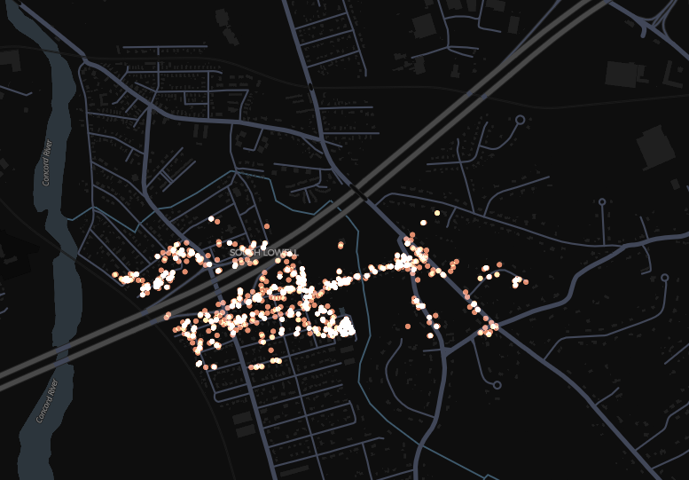
---

### 2000 BSSID Visual
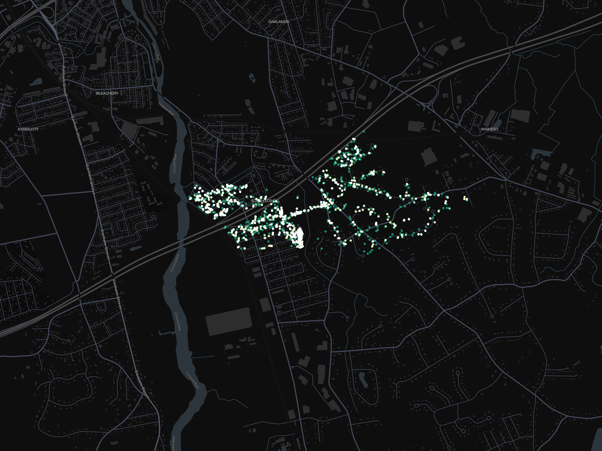
---

### 3000 BSSID Visual
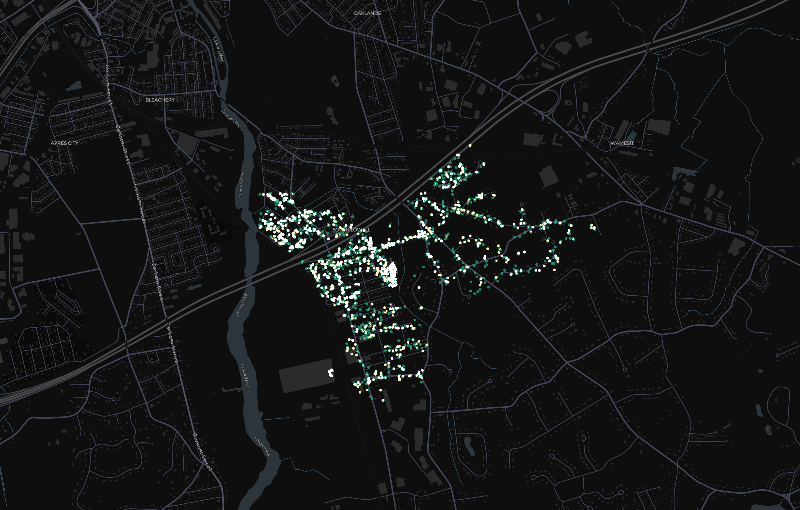
---

### 3850 BSSID Visual
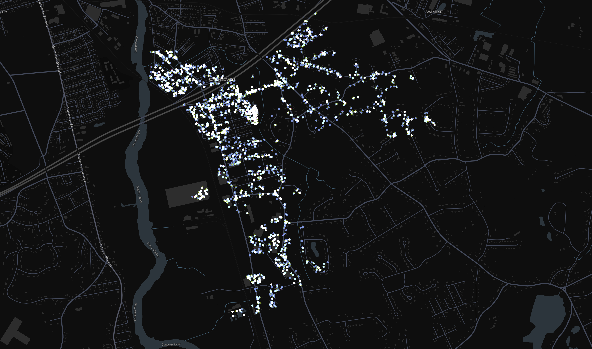
---

### 4000 BSSID Visual
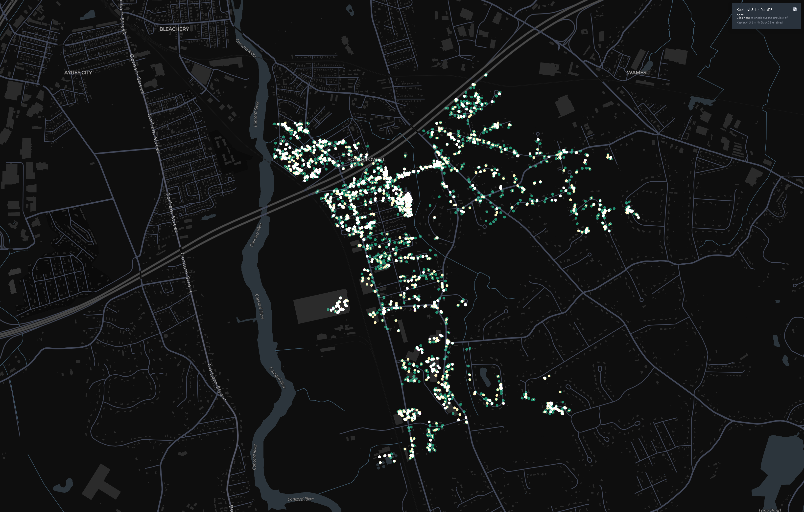
---

### 4000 BSSID Live Map
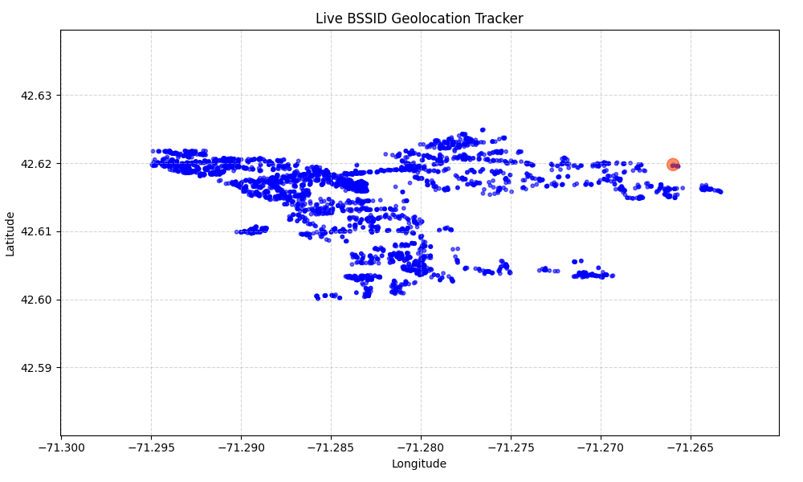
---

### 4000 BSSID Map Hull Shaped Outline
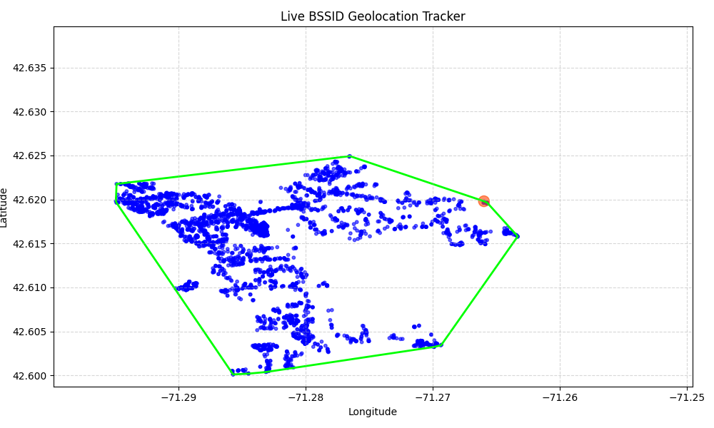
---

### 5000 BSSID Visual
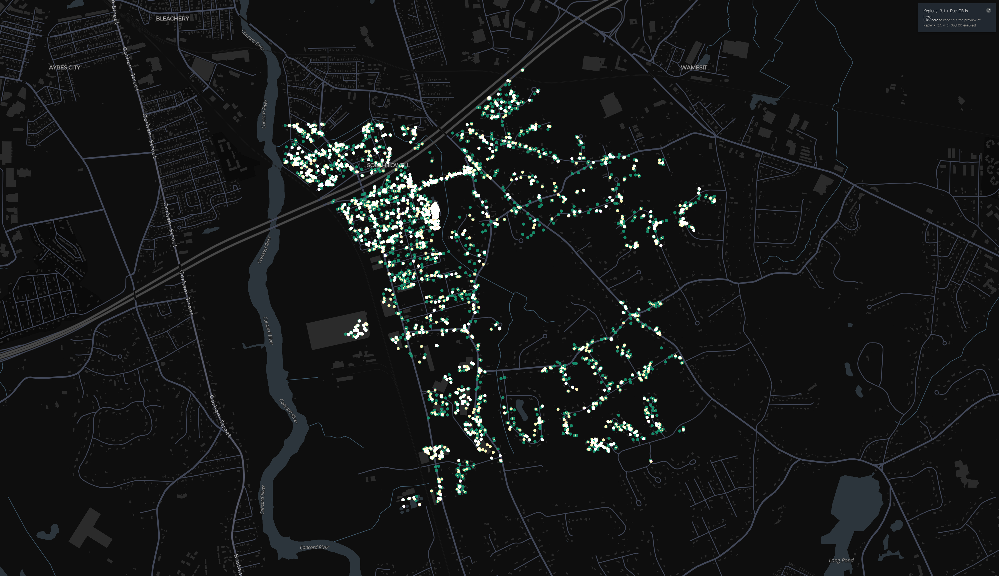
---

### 6500 BSSID Visual
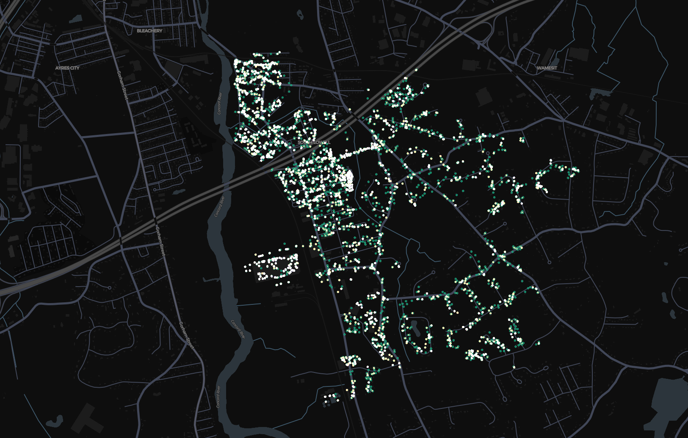
---

### 8750 BSSID Visual
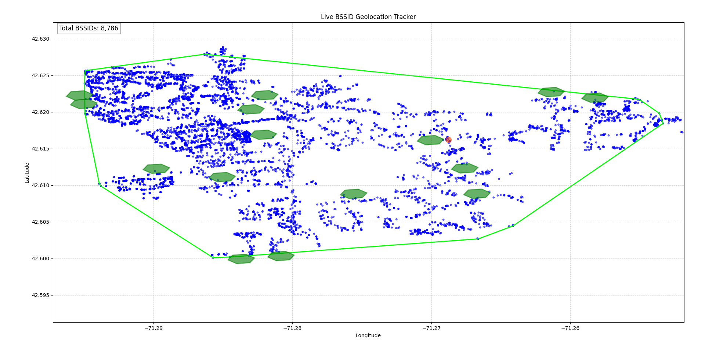
---

### Timeline Map Progress Video (8750)

---

### 36000 BSSID Visual
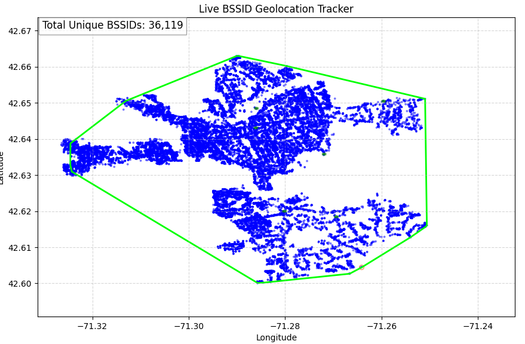
---

### 66000 BSSID Visual

---

### 90000 BSSID Visual
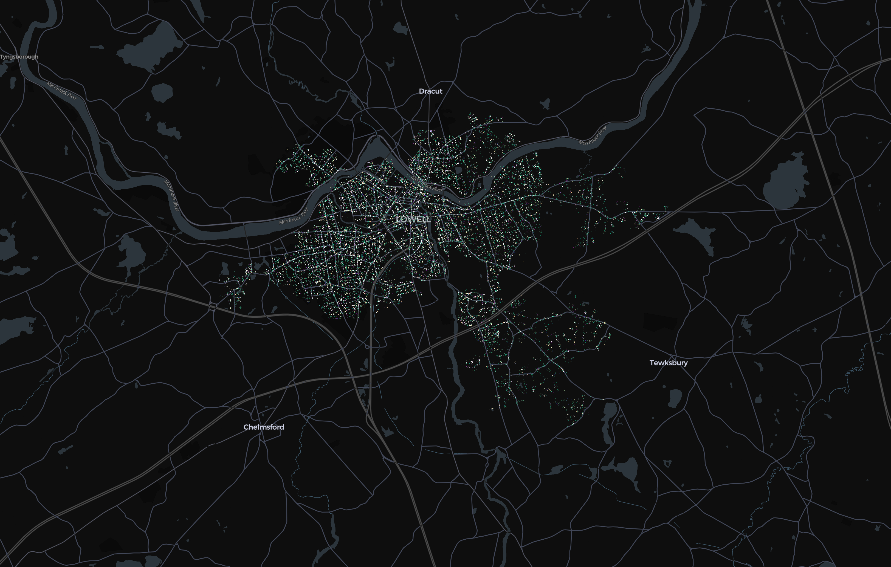
---

### 90000 Live BSSID Visual
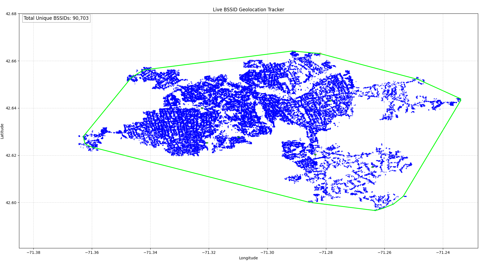
---
